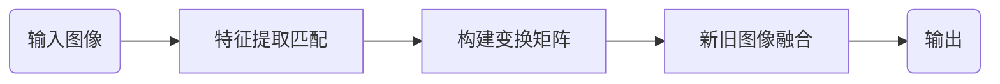
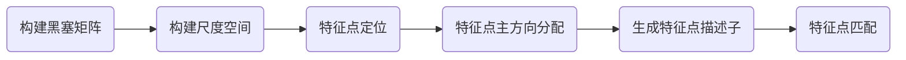

# 基于图像配准的 A Look Into the Past
成员及分工\
PB18051035 王旭 调研 代码 报告\
PB18151852 刘宇 调研 代码 报告
## 问题描述
对图像作变幻，看起来是一件相对简单且有趣的事。所以，我们在选了A Look Into the Past 为主题进行实验，通过残存的光影体会照片里的前世今生。

我们期望通过新旧照片特征匹配，实现图相配准(Image registration)，让旧照片融入到新照片中，达到A Look Into the Past的效果。%%我们采取的样本分为小图（旧照片）匹配大图（新照片）和大图（旧照片）匹配大图（新照片）两种
## 原理分析
图像配准是使用某种算法，基于某种评估标准，将一副或多副图片（局部）最优映射到目标图片上的方法。根据不同配准方法，不同评判标准和不同图片类型，有不同类型的图像配准方法。其中，最本质的分类是：
1. 基于灰度的图像配准；
2. 基于特征的图像配准。

具体的图像配准算法是基于这两点的混合或者变体的算法。我们采用的是基于特征的配准，大致流程为：

### 1. 特征提取匹配
我们采用SURF算法和KAZE算法进行特征匹配。
#### SURF算法
SURF的算法一种稳健的局部特征点检测和描述算法，其步骤如下：

##### 1. 构建Hessian矩阵
黑塞矩阵（Hessian Matrix）是一个多元函数的二阶偏导数构成的方阵，描述了函数的局部曲率。Hessian矩阵是Surf算法的核心，构建Hessian矩阵的目的是为了生成图像稳定的边缘点（突变点），为特征提取做基础。
$$
H(f(x,y))=

\left[\begin{array}{cccc} 
    \frac{\partial^2f}{\partial x^2}  &  \frac{\partial^2f}{\partial y\partial x}\\ 
   \frac{\partial^2f}{\partial x\partial y}  &  \frac{\partial^2f}{\partial y^2}    
\end{array}

\right]
$$
H矩阵的判别式为
$$
det(H)=\frac{\partial^2f}{\partial x^2}\frac{\partial^2f}{\partial y^2}-(\frac{\partial^2f}{\partial y\partial x})^2
$$
当Hessian矩阵的判别式取得局部极大值时，判定当前点是比周围邻域内其他点更亮或更暗的点，由此来定位关键点的位置。
在SURF算法中，图像像素$l(x，y)$即为函数值$f(x，y)$。但是由于我们的特征点需要具备尺度无关性，所以在进行Hessian矩阵构造前，需要对其进行高斯滤波，选用二阶标准高斯函数作为滤波器。
$$
L(x,t)=G(t)I(x,t)
$$
通过特定核间的卷积计算二阶偏导数。通过特定核间的卷积计算二阶偏导数，这样便能计算出H矩阵的三个矩阵元素$L_{xx}$, $L_{xy}$, $L_{yy}$从而计算出H矩阵：
$$
H(x,\sigma)=

\left[\begin{array}{cccc} 
    L_{xx}(x,\sigma)  &  L_{xy}(x,\sigma)\\ 
   L_{yx}(x,\sigma)  &  L_{yy}(x,\sigma)
\end{array}

\right]
$$
##### 2. 构建尺度空间
Surf的尺度空间由O组L层组成,不同组间图像的尺寸都是一致的，但不同组间使用的盒式滤波器的模板尺寸逐渐增大，同一组间不同层间使用相同尺寸的滤波器，但是滤波器的模糊系数逐渐增大。
##### 3. 特征点定位
特征点的定位过程Surf和Sift一致，将经过Hessian矩阵处理的每个像素点与二维图像空间和尺度空间邻域内的26个点进行比较，初步定位出关键点，再经过滤除能量比较弱的关键点以及错误定位的关键点，筛选出最终的稳定的特征点。
##### 4. 特征点主方向分配
在Surf中，采用的是统计特征点圆形邻域内的harr小波特征。
在特征点的圆形邻域内，统计60度扇形内所有点的水平、垂直harr小波特征总和，然后扇形以一定间隔进行旋转并再次统计该区域内harr小波特征值之后，最后将值最大的那个扇形的方向作为该特征点的主方向。

##### 5. 生成特征点描述子
Surf算法中在特征点周围取一个$4\times 4$的矩形区域块，但是所取得矩形区域方向是沿着特征点的主方向。每个子区域统计25个像素的水平方向和垂直方向的haar小波特征，这里的水平和垂直方向都是相对主方向而言的。该haar小波特征为水平方向值之后、垂直方向值之后、水平方向绝对值之后以及垂直方向绝对值之和4个方向。

##### 6. 特征点匹配
Surf通过计算两个特征点间的欧式距离来确定匹配度，欧氏距离越短，代表两个特征点的匹配度越好。Surf还加入了Hessian矩阵迹的判断，如果两个特征点的矩阵迹正负号相同，代表这两个特征具有相同方向上的对比度变化，如果不同，说明这两个特征点的对比度变化方向是相反的，即使欧氏距离为0，也直接予以排除。

### 2.构建变换矩阵
### 3.新旧图像融合
