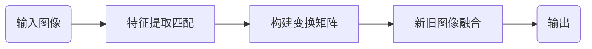
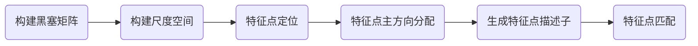

[](https://classroom.github.com/online_ide?assignment_repo_id=6410724&assignment_repo_type=AssignmentRepo)
# 基于图像配准的 A Look Into the Past
成员及分工\
PB18051035 王旭 调研 代码 报告\
PB18151852 刘宇 调研 代码 报告
## 问题描述
对图像作变幻，看起来是一件相对简单且有趣的事。所以，我们在选了A Look Into the Past 为主题进行实验，通过残存的光影体会照片里建筑的前世今生。

我们期望通过新旧照片特征匹配，实现图相配准(Image registration)，让旧照片融入到新照片中，达到A Look Into the Past的效果。
## 原理分析
图像配准是使用某种算法，基于某种评估标准，将一副或多副图片（局部）最优映射到目标图片上的方法。根据不同配准方法，不同评判标准和不同图片类型，有不同类型的图像配准方法。其中，最本质的分类是：
1. 基于灰度的图像配准；
2. 基于特征的图像配准。

具体的图像配准算法是基于这两点的混合或者变体的算法。我们采用的是基于特征的配准，大致流程为（**浏览需要用到[mermaid插件](https://chrome.google.com/webstore/detail/github-%2B-mermaid/goiiopgdnkogdbjmncgedmgpoajilohe)**）：


### 1. 特征提取匹配
我们采用SURF算法和KAZE算法进行特征匹配。
#### SURF算法
SURF的算法一种稳健的局部特征点检测和描述算法，其步骤如下：

##### 1. 构建Hessian矩阵
黑塞矩阵（Hessian Matrix）是一个多元函数的二阶偏导数构成的方阵，描述了函数的局部曲率。Hessian矩阵是Surf算法的核心，构建Hessian矩阵的目的是为了生成图像稳定的边缘点（突变点），为特征提取做基础。\
$$
H(f(x,y))=
\begin{bmatrix}
    \frac{\partial^2f}{\partial x^2}  &  \frac{\partial^2f}{\partial y\partial x}\\\ 
   \frac{\partial^2f}{\partial x\partial y}  &  \frac{\partial^2f}{\partial y^2}     
\end{bmatrix}
$$\
H矩阵的判别式为\
$$
det(H)=\frac{\partial^2f}{\partial x^2}\frac{\partial^2f}{\partial y^2}-(\frac{\partial^2f}{\partial y\partial x})^2
$$\
当Hessian矩阵的判别式取得局部极大值时，判定当前点是比周围邻域内其他点更亮或更暗的点，由此来定位关键点的位置。
在SURF算法中，图像像素$l(x，y)$即为函数值 $f(x，y)$ 。但是由于我们的特征点需要具备尺度无关性，所以在进行Hessian矩阵构造前，需要对其进行高斯滤波，选用二阶标准高斯函数作为滤波器。\
$$
L(x,t)=G(t)I(x,t)
$$\
通过特定核间的卷积计算二阶偏导数。通过特定核间的卷积计算二阶偏导数，这样便能计算出H矩阵的三个矩阵元素$L_{xx}$, $L_{xy}$, $L_{yy}$从而计算出H矩阵：\
$$
H(x,\sigma)=
\begin{bmatrix} 
    L_{xx}(x,\sigma)  &  L_{xy}(x,\sigma)\\\\\
   L_{yx}(x,\sigma)  &  L_{yy}(x,\sigma)
\end{bmatrix}
$$
##### 2. 构建尺度空间
Surf的尺度空间由O组L层组成,不同组间图像的尺寸都是一致的，但不同组间使用的盒式滤波器的模板尺寸逐渐增大，同一组间不同层间使用相同尺寸的滤波器，但是滤波器的模糊系数逐渐增大。
##### 3. 特征点定位
特征点的定位过程Surf和Sift一致，将经过Hessian矩阵处理的每个像素点与二维图像空间和尺度空间邻域内的26个点进行比较，初步定位出关键点，再经过滤除能量比较弱的关键点以及错误定位的关键点，筛选出最终的稳定的特征点。
##### 4. 特征点主方向分配
在Surf中，采用的是统计特征点圆形邻域内的harr小波特征。
在特征点的圆形邻域内，统计60度扇形内所有点的水平、垂直harr小波特征总和，然后扇形以一定间隔进行旋转并再次统计该区域内harr小波特征值之后，最后将值最大的那个扇形的方向作为该特征点的主方向。


##### 5. 生成特征点描述子
Surf算法中在特征点周围取一个$4\times 4$的矩形区域块，但是所取得矩形区域方向是沿着特征点的主方向。每个子区域统计25个像素的水平方向和垂直方向的haar小波特征，这里的水平和垂直方向都是相对主方向而言的。该haar小波特征为水平方向值之后、垂直方向值之后、水平方向绝对值之后以及垂直方向绝对值之和4个方向。

##### 6. 特征点匹配
Surf通过计算两个特征点间的欧式距离来确定匹配度，欧氏距离越短，代表两个特征点的匹配度越好。Surf还加入了Hessian矩阵迹的判断，如果两个特征点的矩阵迹正负号相同，代表这两个特征具有相同方向上的对比度变化，如果不同，说明这两个特征点的对比度变化方向是相反的，即使欧氏距离为0，也直接予以排除。
```
ptsOriginal  = detectSURFFeatures(original);
ptsDistorted = detectSURFFeatures(distorted);
[featuresOriginal,  validPtsOriginal]  = extractFeatures(original,  ptsOriginal);
[featuresDistorted, validPtsDistorted] = extractFeatures(distorted, ptsDistorted);
```
#### KAZE 算法

KAZE算法是非线性扩散滤波法。具体地，非线性扩散滤波法是将图像亮度（L）在不同尺度上的变化视为某种形式的流动函数（flow function）的散度（divergence），可以通过非线性偏微分方程来描述：
$$
\frac{\partial L}{\partial t}=div(c(x,y,t)\nabla L)
$$
通过设置合适的传导函数 c(x,y,t) ，可以使得扩散自适应于图像的局部结构。传导函数可以是标量、也可以是张量。时间t作为尺度参数，其值越大、则图像的表示形式越简单。Perona和Malik提出了传导函数的构造方式：
$$
c(x,y,t)=g(|\nabla L_\sigma(x,y,t)|)
$$
由于非线性微分方程没有解析解，一般通过数值分析的方法进行迭代求解。传统上采用显式差分格式的求解方法只能采用小步长，收敛缓慢。KAZE中采用AOS(Additive Operator Splitting)算法对结果进行收敛。
```
ptsOriginal  = detectKAZEFeatures(original);
ptsDistorted = detectKAZEFeatures(distorted);
```
### 2.构建变换矩阵

这一部分的主要内容是通过匹配点对构建图像序列之间的变换矩阵。实验中通过Matlab自带的estimateGeometricTransform2D函数实现。
```
indexPairs = matchFeatures(featuresOriginal, featuresDistorted);

matchedOriginal  = validPtsOriginal(indexPairs(:,1));
matchedDistorted = validPtsDistorted(indexPairs(:,2));
[tform, inlierIdx] = estimateGeometricTransform2D(...
    matchedDistorted, matchedOriginal,'similarity','Maxdistance',1.5,'Confidence',99,'MaxNumTrials',1000);
```
### 3.新旧图像融合

使用imwrap函数对图像进行仿射变换，输入参数是待变换的二维图像image和一个3x3的仿射变换矩阵tform，imwrap原理：
输入图像上的点(u,v)对应输出图像上的点(x,y)，关系式为：\
                  

在计算输出图像的所有(x,y)对的时候，需要乘以A的逆矩阵然后在输入图像中插值得到输出图像。

我们的目标是实现一种从旧图像到新图像之间的渐变效果，为了达到这个效果，首先构造以旧图像中心为中心的，幅度从中心值1往边缘减小至0的函数矩阵。我们选择的是经过修正的巴特沃斯滤波器函数，定义原来图片的宽为DX，长为DY，点(x,y)的修正距离D(x,y)定义为：\
                  

巴特沃斯函数：\
              

$D_0$是修正截止距离，我们选择$D_0=D(0.76DX,0.76DY)$；n是阶数，选择n=8。

将$H_n (x,y)$与旧图像相乘得到输出部分1，再把$H_n (x,y)$通过相同的变换矩阵tform进行仿射变换后，取反再与新图像相乘得到输出部分2，把部分1、2相加即可得到最终结果。
```
f1=im2double(dist0);
t1=zeros(size(f1)); 
t2=t1;
LD=norm([d0-1/2,d0-1/2],2);
tx=size(t1,2);
ty=size(t1,1);
for k=1:3
for j=1:size(t1,1)
    for i=1:size(t1,2)
        d=norm([i/tx-0.5,j/ty-0.5],2);
        t2(j,i,k)=1-1/(1+(d/LD)^p0);
        t1(j,i,k)=1-t2(j,i,k);
    end
end
end
dist0=im2uint8(im2double(dist0).*t1);
t1=im2uint8(t1);
t2=im2uint8(t2);
outputView = imref2d(size(original));
recovered  = imwarp(dist0,tform,'OutputView',outputView);
re2=imwarp(t1,tform,'OutputView',outputView);
re2=255-re2;
orig0=im2uint8(im2double(orig0).*im2double(re2));
```

## 功能展示

- 故宫\


- 教堂\


- 大桥\


## 工程结构
```
.
├── code
│   ├── main.m
│   └── cv_Image_registration_.m
├── input
│   ├── new1.png
│   ├── new2.png
│   ├── new3.png
│   ├── old1.png
│   ├── old2.png
│   └── old3.png
└── output
    ├── result1.png
    ├── result2.png
    └── result3.png
```
## 运行说明
运行环境：\
MATLAB 2021a\
Computer Vision Toolbox
